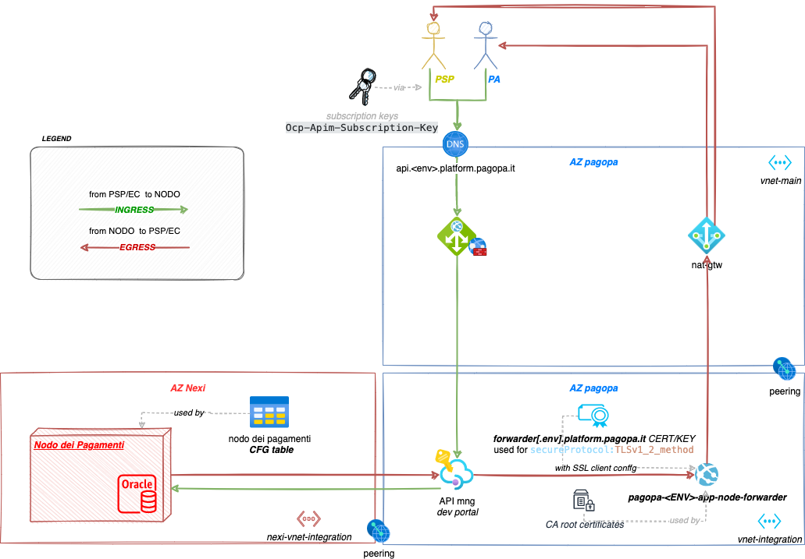

# pagoPA node forwarder 

The microservice behaves like a "proxy": it receives requests from the [Nodo Dei Pagamenti](https://github.com/pagopa/pagopa-nodo4-nodo-dei-pagamenti)  and forwards them to the endpoint of the EC or PSP.


<details>
  <summary>NAT gateway IPs</summary>

### Outbound pagopa-natgw ips
- UAT env `20.56.27.220`
- PROD env `20.86.139.154` or `20.86.139.86`

</details>

## Api Documentation 📖
See the [OpenApi 3 here.](https://editor.swagger.io/?url=https://raw.githubusercontent.com/pagopa/pagopa-node-forwarder/main/openapi/openapi.json)


---

## Technology Stack
- Java 11
- Spring Boot
- Spring Web
- Hibernate
- JPA
---

## Start Project Locally 🚀

### Prerequisites
- docker

### Run docker container
from `./docker` directory

`sh ./run_docker.sh dev`

ℹ️ Note: for PagoPa ACR is required the login az acr login -n <acr-name>

---

## Develop Locally 💻

### Prerequisites
- git
- maven
- jdk-11

### Run the project

Start the springboot application with this command:

`mvn spring-boot:run -Dspring-boot.run.profiles=local`


### Spring Profiles

- **local**: to develop locally.
- _default (no profile set)_: The application gets the properties from the environment (for Azure).


### Testing 🧪

#### Manual testing

> NOTE : under `mock` folder run local server typing `node server.js`

Open terminal and typing : 
```sh
curl -i --location --request POST 'http://localhost:8080/forward' \
--header 'X-Host-Url: server.aaa.com' \
--header 'X-Host-Port: 8888' \
--header 'X-Host-Path: /path' \
--header 'Content-Type: application/xml' \
--data-raw '<hi></hi>'
```

if all right y'd see something like that 

```sh
HTTP/1.1 200
X-Request-Id: fab331b9-8f1d-48d1-a596-ccbaddf778ff
Vary: Origin
Vary: Access-Control-Request-Method
Vary: Access-Control-Request-Headers
Date: Thu, 03 Nov 2022 06:21:22 GMT
Connection: keep-alive
Keep-Alive: timeout=5
Transfer-Encoding: chunked
Content-Type: text/plain;charset=UTF-8
Transfer-Encoding: chunked

OK!
```


#### Unit testing
To run the **Junit** tests:

`mvn clean verify`

#### Integration testing
From `./integration-test/src`

1. `yarn install`
2. `yarn test`

#### Performance testing
install [k6](https://k6.io/) and then from `./performance-test/src`

1. `k6 run --env VARS=local.environment.json --env TEST_TYPE=./test-types/load.json main_scenario.js`


### Cert utilities

Open terminal and under `script` folder typing

> NOTE `<my_cert_file_name>.pfx` should be into current working directory
```sh
sh scripts/cert_generator.sh ~/<my_cert_file_name>.pfx
```

if all right following files are created : 

```sh
scripts/
├── certificate-key.der
├── certificate-key.pem
└── certificate.crt
```

---

## Contributors 👥
Made with ❤️ by PagoPa S.p.A.

### Mainteiners
See `CODEOWNERS` file
